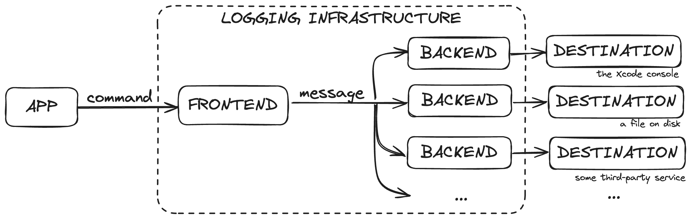
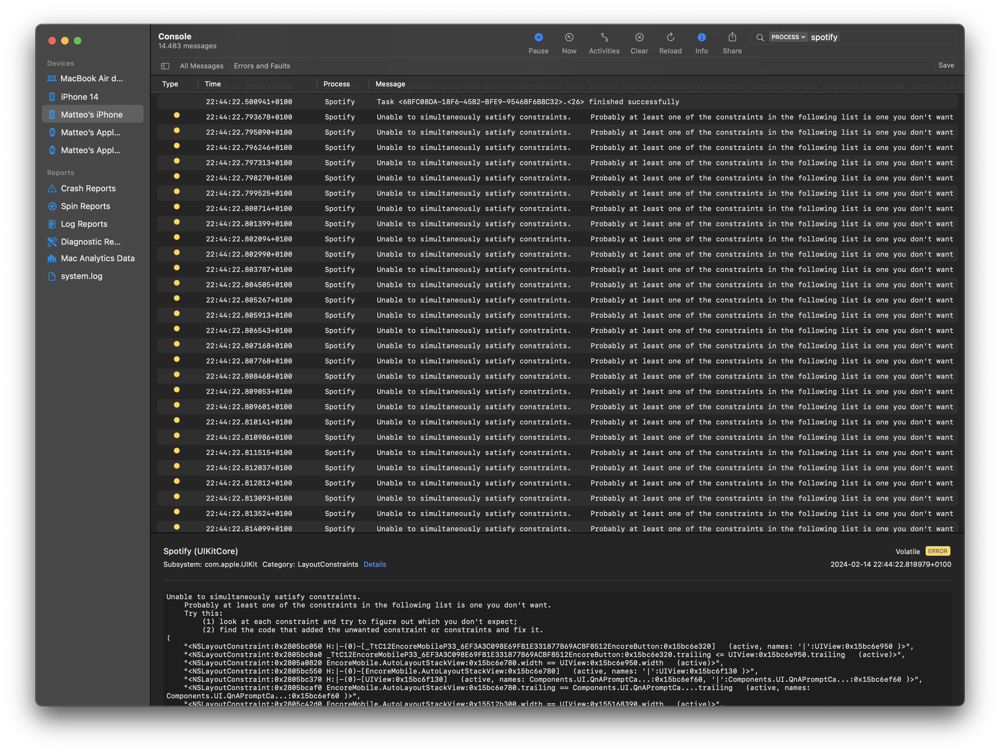

theme: Delicious, 6


# Logging on iOS

---

# Terminology

An app sends a command to the [frontend](). The frontend transforms the command into a [message](). Each message is forwarded to [one or more backends](). Each backend writes to a [destination]().

---



---

A long time ago, in a galaxy far, far away...

^ A couple of months back I set out to integrate logging in one of my side projects. While working on this, I explored many of the available solutions. This presentation shows the findings of this process.

---

> This is **NOT a proposal!**<br><br>

This is a (hopefully) helpful place to get started when trying to learn more about the topic

^ Since we have been talking about this topic I want to make this clear. The reason why I wanted to share this is that I found that getting a larger picture of what's available can help one make a more informed decision. This is not a decision or a proposal about what we should use in the Subito app. Some of this might not even 100% meet the requirements of the Subito app.

---

[.column]

# Required

^ Speaking of requirements, these were my requisites and nice-to-haves. You will see later on that I selected or discarded solutions based on these.

* File-based

^ File-based. I wanted to add a functionality where users would be able to shake the device and get a modal asking them whether they want to report that something went wrong by sending me an email. This email will include logs as an attachment to help me troubleshoot. Pretty standard stuff.

^ For this to work the app needs to be able to locally access the logs file. This might seem trivial at first. I was really surprised to learn that this is not something that all logging libraries provide.

* Battle-tested

^ Battle-tested because I also don't want to debug the code I use to debug other code. I also would be mad if I found out that the app crashed just because of logging.

[.column]

# Nice-to-have

* Performant

^ It's not that I want the most performant implementation ever because I don't need nor want to have a lot of logs. I just want to see that performance is considered so that I can sleep reasonably well.

* Decent API[^1]

[^1]: See the [What's the problem with Wrapping OSLog](https://steipete.com/posts/logging-in-swift) section

^ You might think that this is not really important. You can always just wrap it and introduce a decent API. The thing is that you don't really want to wrap logging libraries. Not just because maintaining a wrapper is not ideal. In general, logging libraries are very specific in how they evaluate parameters to an invocation. As an example, they might be designed to skip the evaluation of parameters for logs at level DEBUG when the level is INFO. By wrapping them you end up end up breaking optimizations/functionality.

* Structured logging

^ This is a very fancy name that is widely used in the industry to say that log lines use a parsable format and include a standard set of metadata. I got this from the backend world where it is the standard. When you have a large log file it is useful to be able to parse a standard format rather than complex commands to extract the lines you are interested in. It also helps a ton with ensuring consistency while preserving flexibility.

---

👎 __BAD__

```
ERROR 2024-02-13 20:22:55 – [Launcher] Something happened
```

👍 __GOOD__

```json
{
  "level": "ERROR",
  "time": "2024-02-13T20:22:55.969Z",
  "subsystem": "launcher",
  "msg": "something happened"
}
```

[.footer: I am not [the](https://www.sumologic.com/glossary/structured-logging/) [only](https://go.dev/blog/slog) [one](https://developer.apple.com/videos/play/wwdc2023/10226/) praising structured logging]

---

# [OSLog](https://developer.apple.com/documentation/oslog)

* Apple-provided system framework
* Great performance, reliability, API design, documentation, privacy, integration, ...
* Apps can only read logs for their __current run__[^3]

[^3]: Limitation acknowledged by @eskimo in an [issue](https://developer.apple.com/forums/thread/691093)

^ The first thing I looked at is OSLog.

^ Awesome for many reasons, No need for additional dependencies. It is used by all Apple OSes. On iOS it works by writing to a system-wide file managed by the OS. Amazing integration with Xcode.

^ Unfortunately, the app can only read entries for the current run. (see [`OSLogStore getEntries(with:at:matching:)`](https://developer.apple.com/documentation/oslog/oslogstore/getentries(with:at:matching:)). You can't implement the experience I shared earlier. The app cannot report the steps the user took leading up to a crash or any issue that happened during previous runs.

^ You as a developer can read logs for all apps and runs using Console.app. Unless the OS rotated what you are interested in. Remember that is the OS that manages the file, not you. :]

---



^ The fact that you can read logs for all apps means that you can find fun stuff. You might be relieved by learning that everyone has a tough time with stack views.

---

# [SwiftLog](https://github.com/apple/swift-log)

- Open-source frontend by Apple
- No backend = "batteries not included"
- Many [community-maintained backends](https://github.com/apple/swift-log?tab=readme-ov-file#available-logging-backends-for-applications) are available

^ SwiftLog is an API package that tries to establish a common API the ecosystem can use. Being only a frontend, it does not do anything by itself. It needs a backend.

---

| Name | Destination |
| - | - |
| [`swift-log-slack`](https://github.com/wlisac/swift-log-slack) | a Slack channel |
| [`swift-log-telegram`](https://github.com/stevapple/swift-log-telegram) | a Telegram chat |
| [`swift-log-elk`](https://github.com/Apodini/swift-log-elk) | Logstash |
| [`swift-log-datadog`](https://github.com/jagreenwood/swift-log-datadog) | Datadog |
| [`GoogleCloudLogging`](https://github.com/DnV1eX/GoogleCloudLogging) | Google Cloud Platform |
| [`SwiftLogFireCloud`](https://github.com/google/swiftlogfirecloud) | Firebase Cloud Storage |

^ To give you a sense of the diversity of backends available. This is a list of some. You will see that there's a little bit of everything.

---

| Name | Destination |
| - | - |
| [`CocoaLumberjack`](https://github.com/CocoaLumberjack/CocoaLumberjack) | Most popular Objective-C library |
| [`SwiftyBeaver`](https://github.com/SwiftyBeaver/SwiftyBeaver) | Most popular Swift library |
| [`Puppy`](https://github.com/sushichop/Puppy) | Multiple files with rotation, looks good but not battle-tested[^4] |
| [`swift-log-file`](https://github.com/crspybits/swift-log-file) | A single file with no rotation |

[^4]: Author is [CocoaLumberjack's 4th most active contributor](https://github.com/CocoaLumberjack/CocoaLumberjack/graphs/contributors)

^ In this slide, I collected all file-based backends. We have the most popular logging libraries out there in CocoaLumberjack and SwiftyBeaver. Puppy seems to be an up-and-coming new one developed by one of the core contributors of CocoaLumberjack. I also found a really interesting one that implements file-based logging but uses a single log file and does not implement rotation. This is only available on iOS. I'd be really curious to know if someone is using it without realizing this - filling up iPhones all over the world.

---

| Name | Destination |
| - | - |
| [`CocoaLumberjack`](https://github.com/CocoaLumberjack/CocoaLumberjack) | Most popular Objective-C library |
| [`SwiftyBeaver`](https://github.com/SwiftyBeaver/SwiftyBeaver) | Most popular Swift library |
| [`Puppy`](https://github.com/sushichop/Puppy) | Multiple files with rotation, looks good but not battle-tested[^4] |
| [`swift-log-file`](https://github.com/crspybits/swift-log-file) | A single file with no rotation |


^ Just considering the two most popular libraries I have to say that the situation is pretty bad.

^ The CocoaLumberjack integration is incomplete. The metadata you provide to logs invocation is simply ignored.

^ The SwiftyBeaver integration listed in swift-log's README is not provided by SwiftyBeaver itself. It's a separate package with 4 stars that you need to import and that does not actually support all SwiftyBeaver features. It just crashes if you set the log format to JSON. This is not some remote use case. This is the second format example listed in the library's README file.

---

```swift
import Logging

LoggingSystem.bootstrap(StreamLogHandler.standardError)

let logger = Logger(label: "com.example.BestExampleApp.main")
logger[metadataKey: "request-uuid"] = "\(UUID())"
logger.info("Hello World!")
logger.error("Houston, we have a problem: \(problem)")
```

[.footer: see [LoggingSystem](https://apple.github.io/swift-log/docs/current/Logging/Enums/LoggingSystem.html#/s:7Logging0A6SystemO9bootstrapyyAA10LogHandler_pSScFZ)]

^ Based on this, I had to discard swift-log. The idea of using a common frontend and connecting/replacing backends a will was really captivating. However, all file-based backends are unusable for my purposes. Also, the idea of adding 2/3 dependencies is not so exciting. So I started to investigate the idea of just using one of CocoaLumberjack or SwiftyBeaver for both the frontend and the backend.

---

# [CocoaLumberjack](https://github.com/CocoaLumberjack/CocoaLumberjack)

- Most battle-tested (Meta, Tinder, ...)
- Still very active
- Great extensibility but batteries included
- Amazing documentation
- Objective-C

^ Was my first option since it has been around forever and is used by very consequential apps. Has been around for 11+ years and you still see optimization work being made. They take great care, they just added a privacy manifest even if they are not required to.

^ Great file-based logging with rotation and retention window support. Also OSLog integration. It has been used so widely that it basically supports any kind of extension/modification you might think of.

---
[.autoscale: true]

* [Getting Started](https://github.com/CocoaLumberjack/CocoaLumberjack/blob/master/Documentation/GettingStarted.md): Get up and running using the Lumberjack Framework.
* [ARC](https://github.com/CocoaLumberjack/CocoaLumberjack/blob/master/Documentation/ARC.md): Supporting ARC files in a non-ARC project.
* [Xcode Tricks](https://github.com/CocoaLumberjack/CocoaLumberjack/blob/master/Documentation/XcodeTricks.md): Using different log levels for Debug and Release builds.
* [Per Logger Log Levels](https://github.com/CocoaLumberjack/CocoaLumberjack/blob/master/Documentation/PerLoggerLogLevels.md): Using different log levels for each logger.
* [Xcode Colors](https://github.com/CocoaLumberjack/CocoaLumberjack/blob/master/Documentation/XcodeColors.md): Use colors in the Xcode debugging console.
* [Custom Formatters](https://github.com/CocoaLumberjack/CocoaLumberjack/blob/master/Documentation/CustomFormatters.md): How to write your own custom formatters.
* [FAQ](https://github.com/CocoaLumberjack/CocoaLumberjack/blob/master/Documentation/FAQ.md): Frequently asked questions.
* [Performance](https://github.com/CocoaLumberjack/CocoaLumberjack/blob/master/Documentation/Performance.md): Analysis of performance with benchmarks.
* [Problem Solution](https://github.com/CocoaLumberjack/CocoaLumberjack/blob/master/Documentation/ProblemSolution.md): Common issues you may encounter and their solutions.
* [AppCode Support](https://github.com/CocoaLumberjack/CocoaLumberjack/blob/master/Documentation/AppCode-support.md) How to use CocoaLumberjack in AppCode.
* [Architecture](https://github.com/CocoaLumberjack/CocoaLumberjack/blob/master/Documentation/Architecture.md): Lumberjack internals & overview.
* [Custom Context](https://github.com/CocoaLumberjack/CocoaLumberjack/blob/master/Documentation/CustomContext.md): Taking advantage of logging contexts.
* [Custom Loggers](https://github.com/CocoaLumberjack/CocoaLumberjack/blob/master/Documentation/CustomLoggers.md): How to write your own custom loggers.
* [Custom Log Levels](https://github.com/CocoaLumberjack/CocoaLumberjack/blob/master/Documentation/CustomLogLevels.md): How to add or customize log levels.
* [Per User Log Levels](https://github.com/CocoaLumberjack/CocoaLumberjack/blob/master/Documentation/PerUserLogLevels.md): Different log levels per developer.
* [Dynamic Log Levels](https://github.com/CocoaLumberjack/CocoaLumberjack/blob/master/Documentation/DynamicLogLevels.md): Dynamically changing log levels during run-time.
* [Fine Grained Logging](https://github.com/CocoaLumberjack/CocoaLumberjack/blob/master/Documentation/FineGrainedLogging.md): When you need something more advanced than simple log levels.
* [Log File Management](https://github.com/CocoaLumberjack/CocoaLumberjack/blob/master/Documentation/LogFileManagement.md): Compress your log files, or upload them to a server.

^ Documentation for the library is just great. There are in-depth technical deep-dives into the library architecture and performance, guides on how to customize all different aspects, and even "tricks".

---

```swift
open class DDLogMessage : NSObject, NSCopying, @unchecked Sendable {
  open var message: String { get }
  open var messageFormat: String { get }
  open var level: DDLogLevel { get }
  open var flag: DDLogFlag { get }
  open var context: Int { get }
  open var file: String { get }
  open var fileName: String { get }
  open var function: String? { get }
  open var line: UInt { get }
  open var representedObject: Any? { get }
  open var options: DDLogMessageOptions { get }
  open var timestamp: Date { get }
  open var threadID: String { get }
  open var threadName: String? { get }
  open var queueLabel: String { get }
  open var qos: UInt { get }
}

final class LogFormatter: NSObject, DDLogFormatter {
  func format(message: DDLogMessage) -> String? {
    // do your thing
  }
}
```

[.footer: see [Custom Formatters](https://github.com/CocoaLumberjack/CocoaLumberjack/blob/master/Documentation/CustomFormatters.md)]

^ It does not provide support for out-of-the-box support for structured logging. You can build it yourself on top of the custom formatters API.

^ You'll notice by this example that the library comes from the world of Objective-C. However all of the possible annotations you may think of have been added and the experience of using it from Swift is fine. You definitely can tell that was not designed for Swift though.

---

# [SwiftyBeaver](https://github.com/SwiftyBeaver/SwiftyBeaver)

- Widely used (Epic, Mozilla, ...)
- Little activity in the last 2 years
- JSON-based structured logging out-of-the-box
- Swift

^ SwiftyBeaver is not as popular as CocoaLumberjack but is still very widely used

^ Unlike CocoaLumberjack is very much Swift native as the name suggests.

^ Commits since January 2021 are 4 bug fixes and toil/typos. That doesn't really inspire much confidence.

^ Provides 1-line API to output JSON. It's pretty comprehensive. You get a lot with very little.

---

```swift
let console = ConsoleDestination()
console.format = "$J"

let logger = SwiftyBeaver.self
logger.addDestination(console)
logger.info("message", context: ["key": "value"])
```

```json
{
  "level": 2,
  "thread": "",
  "context": { "key": "value" },
  "message": "message",
  "timestamp": 1707954785.5973361,
  "function": "init()",
  "file": "\/Users\/matteo\/dev\/LoggingOnIOS\/LoggingOnIOS\/App.swift",
  "line": 14
}
```

^ Log entries include a lot of interesting information out of the box. File and function names, line numbers, and even the invoking thread. I found the thread particularly interesting because it is not something I ever saw being logged by default but it can definitely be useful.

---

```swift
let console = ConsoleDestination()
console.format = "$J"

let logger = SwiftyBeaver.self
logger.addDestination(console)

struct Something {}
logger.info("message", context: Something()) 💥

// Terminating app due to uncaught exception
// 'NSInvalidArgumentException', reason: 'Invalid
// type in JSON write (__SwiftValue)
```

^ Implementation does not seem as mature as CocoaLumberjack. To implement this JSON formatting functionality, it just passes the `Any` context parameter you provide to `NSJSONSerialization`. This is not great because if your parameter references a Swift-only type, you will get a runtime crash. This does not seem very well thought out and frightens me a bit.

---

# [Willow](https://github.com/Nike-Inc/Willow)

- By Nike
- No file-based logging[^5]
- Nice API design

^ After going through all of this, Marco reminded me of Nike-Inc/Willow. I was really interested at first but then I found out that this is another bring-you-own file management library. 

^ It provides a frontend and backends for the console/OSLog. At Nike, they have a backend that persists to a file. They say it's coupled with their internal infrastructure and it can't be easily extracted.

^ What I really like about it is the API design.

[^5]: Limitation acknowledged by the author in an [issue](https://github.com/Nike-Inc/Willow/issues/2#issuecomment-229593187)

[.footer: Thanks @maross!]

---

```swift
import Willow

enum Message: LogMessage {
    case requestStarted(url: URL)
    case requestCompleted(url: URL, response: HTTPURLResponse)

    var name: String {
        switch self {
        case .requestStarted:   "Request started"
        case .requestCompleted: "Request completed"
        }
    }

    var attributes: [String: Any] {
        switch self {
        case let .requestStarted(url):
            ["url": url]
        case let .requestCompleted(url, response):
            ["url": url, "response_code": response.statusCode]
        }
    }
}

let url = URL(string: "https://httpbin.org/get")!
let logger = Logger(logLevels: [.all], writers: [ConsoleWriter()])
logger.debug(Message.requestStarted(url: url))
```

^ This is what Willow code looks like. You are forced to define a type to model each log entry. This might seem a bit of an overkill at first but it really helps with consistency. I think you might be able to tell that I love consistency in code. :] It also allows you to conform existing types to `LogMessage` idea. I am thinking that one might add this to `Action` types in a TCA app or the networking `Request`/`Response` types which sounds like an interesting idea.
